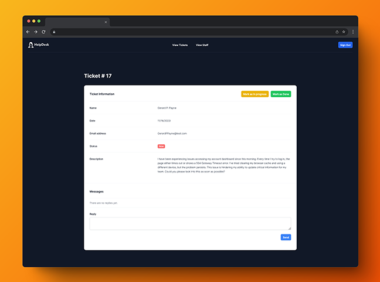

<div align="center">
  <h3 align="center">HelpDesk</h3>
  <p align="center">
    <br />
  </p>
  
</div>

## How It's Made:
This project is a web-based help desk and support ticket management system built with Next.js, styled with TailwindCSS, and integrated with Supabase for backend services. It enables users to submit support ticket requests and allows support staff to manage these tickets efficiently.

## Features

- **User Interface for Ticket Submission:** Users can submit support ticket requests, including their name, email, and a detailed description of their issue.
- **Admin Panel:** A separate backend interface for staff to view a summary of all tickets, with features to respond to requests and update ticket statuses.
- **Ticket Status Management:** Support staff can update the status of each ticket, with possible statuses including *new*, *in progress*, and *resolved*.
- **Staff Roles:** There are distinct roles for staff, including Support, Manager, and Admin.
  - **Support:** Handles day-to-day ticket resolution.
  - **Manager:** Oversees ticket management and support operations.
  - **Admin:** Possesses full system access, including the ability to add or manage other staff members.

## Tech Used:
[![JS][Next.JS]][Next.JS]
[![Supabase][Supabase]][Supabase]
[![NodeJS][Node.JS]][Node.JS]
[![TailwindCSS][Tailwind.CSS]][Tailwind.CSS]


## Installation

```sh
npm install
```
### Things to add

- Create a `.env` file in config folder and add the following as `key = value`
  - NEXT_PUBLIC_SUPABASE_URL = `Your Supabase project URL`
  - NEXT_PUBLIC_SUPABASE_ANON_KEY = ` Your Supabase anon key`

- Set up the database using the schema provided at `/database/schema.sql`.
- You can access the admin panel using the default admin account:
    - Email: `admin@example.com`
    - Password: `qwerty`

### Run
Start the development server
```sh
npm run dev
```

<!-- MARKDOWN LINKS & IMAGES -->
[Next.JS]: https://img.shields.io/badge/Next.js-000?logo=nextdotjs&logoColor=fff&style=for-the-badge
[Node.JS]: https://img.shields.io/badge/Node.js-43853D?style=for-the-badge&logo=node.js&logoColor=white
[Tailwind.CSS]: https://img.shields.io/badge/Tailwind_CSS-38B2AC?style=for-the-badge&logo=tailwind-css&logoColor=white
[Supabase]: https://img.shields.io/badge/Supabase-181818?style=for-the-badge&logo=supabase&logoColor=white